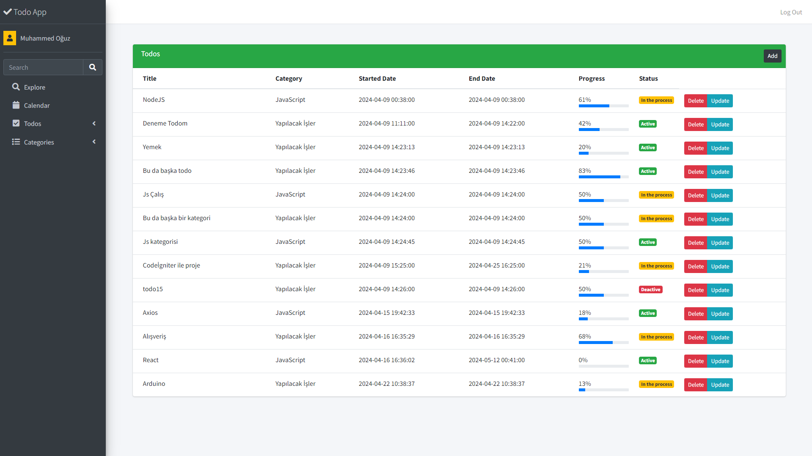
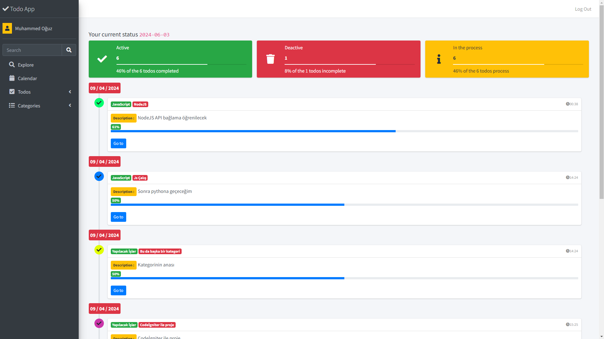
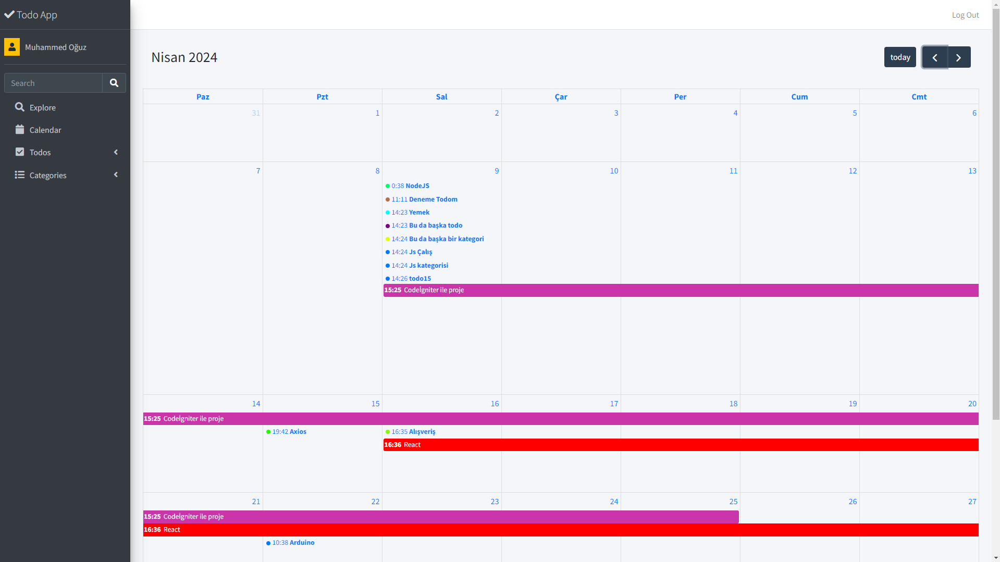

# Full Responsive Todo App

#### Bu uygulamanın amacı kullanıcının kategorileri içerisinde yapılacaklar listesi oluşturup bunları güncelleyebileceği bir arayüz oluşturmaktır.

## Uygulama nasıl kuruluyor ? 

#### - Kişisel bilgisayarınıza XAMPP uygulamasını indirip htdocs içerisine projeyi atıyorsunuz.

#### - XAMPP mySQL "root" şifresini 12345 olarak değiştiriyorsunuz. (bu durumu config içerisindeki config.php dosyasını güncelleyerek kendinize göre ayarlayabilirsiniz.)

#### - sql-data klasörü içerisindeki .sql dosyasını mysql database' inizde çalıştırıyor table ve girdilerinizi oluşturuyorsunuz. 

#### - users içerisindeki tabloya kendi mail ve şifrenizi (şifrenizi md5 formatter sitesinden md5 formatına çevirmeniz gerekmektedir.) giriyorsunuz.

#### - projenizi XAMPP apache sunucunuzu açıyor, tarayıcınızda http://localhost url'ini giriyorsunuz.

#### - ayarladığınız e-posta ve şifreyi girerek hesabınıza giriş yapabilirsiniz.

#### - varsayılan olarak gelen mail muhammedoguz@gmail.com şifre ise 12345aA dır.

# Görseller : 

